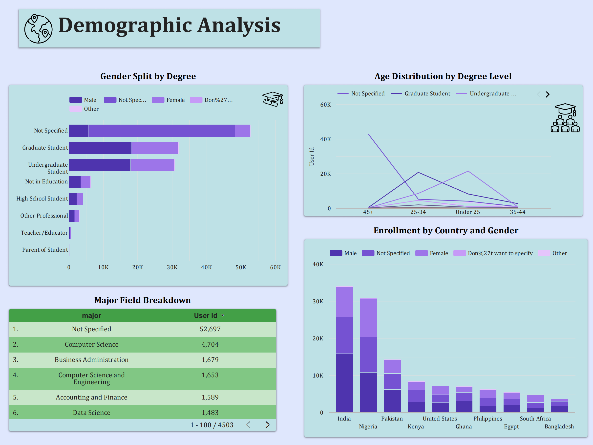

# 📊 Excelerate Data Visualization Virtual Internship – Team 44

## 📌 Overview
This project was completed as part of the **Excelerate Data Visualization Virtual Internship**. Over four weeks, our team transformed raw datasets into **meaningful insights** through data cleaning, analysis, visualization, and storytelling.  
The final outcome was an **interactive Looker Studio dashboard** and a **presentation for stakeholders**, enabling data-driven decision-making.

---

## 🎯 Objectives
- Clean, structure, and integrate multiple datasets.
- Perform **Exploratory Data Analysis (EDA)** to uncover trends, patterns, and anomalies.
- Design and develop an interactive **Looker Studio** dashboard.
- Present data-driven insights and recommendations to stakeholders.

---

## 🛠 Tools & Technologies
- **SQL (PostgreSQL, pgAdmin)** – Database setup, ETL process, stored procedures.
- **Python (Pandas, NumPy, Matplotlib)** – Data cleaning, EDA, and visualization.
- **Excel** – Mapping tables, quick data validation.
- **Looker Studio** – Dashboard design & visualization.
- **Canva / Google Slides** – Presentation design.

---

## 📅 Project Timeline & Deliverables

### **Week 1 – Data Setup & EDA**
**Deliverables:**
- Installed **PostgreSQL** and loaded all datasets.
- **EDA Report** with:
  - Dataset overview (sources, structure, key attributes)
  - Summary statistics of variables
  - Missing values, duplicates, and inconsistencies
  - Visuals: histograms, box plots, correlation heatmaps
  - Key findings and next steps for cleaning

**Outcome:**  
Laid the foundation for data transformation by understanding dataset quality and patterns.

---

### **Week 2 – ETL & Master Table Creation**
**Deliverables:**
- **Final Master Table** integrating multiple datasets with consistent schema.
- **Table Creation SQL Script** with constraints, indexes, and relationships.
- **Stored Procedure** to:
  - Extract raw data
  - Apply cleaning (remove duplicates, standardize text)
  - Load cleaned data into Master Table
- **Data Quality Report** detailing:
  - Issues detected
  - Cleaning logic applied
  - Validation and testing methodology

**Outcome:**  
A clean, structured, and query-ready dataset prepared for dashboard development.

---

### **Week 3 – Dashboard Wireframing**
**Deliverables:**
- **Mapping Table (Excel)** aligning data points and relationships across sources.
- **Wireframe** (annotated) for Looker Studio dashboard:
  - Placement of KPIs, charts, and filters
  - User experience and navigation flow
  - Drill-down and interactive filter options

**Outcome:**  
A clear blueprint for building a visually engaging and functional dashboard.

---

### **Week 4 – Final Dashboard & Presentation**
**Deliverables:**
- **Google Looker Studio Dashboard** with:
  - Country-wise engagement
  - Degree level & gender distribution
  - Marketing campaign spend and ROI
  - Filters for dynamic exploration
- **Final Presentation** summarizing:
  - Key insights and trends
  - Challenges faced
  - Recommendations for future improvements

**Outcome:**  
A professional, data-driven dashboard and presentation showcasing our ability to interpret and visualize data effectively.

---

## 📊 Key Insights
- **Top Learner Regions:** India & Nigeria lead in engagement, mainly among undergraduates and graduates.
- **Data Gaps:** “Not Provided” is the largest category in opportunity names, limiting deeper analysis.
- **Marketing ROI:** March Brand Awareness campaign had the highest spend and is now measurable against ROI metrics.

---

## 📈 Dashboard Preview

---

## 🚀 Learning Outcomes
- Full **data lifecycle** experience: extraction, cleaning, transformation, visualization, and storytelling.
- Stronger skills in SQL, Python, and Looker Studio.
- Improved ability to align data insights with business strategy.

---

## 👥 Team Members
- Laiba Shabbir  
- Abdullah Dar  
- Fouzia Ashfaq  
- Saavri Dua  

---

## 🔗 Links
- **Interactive Dashboard:** [View Here](https://lookerstudio.google.com/reporting/b3cc2218-5a3f-4f86-b851-9fe0bb76a279)

